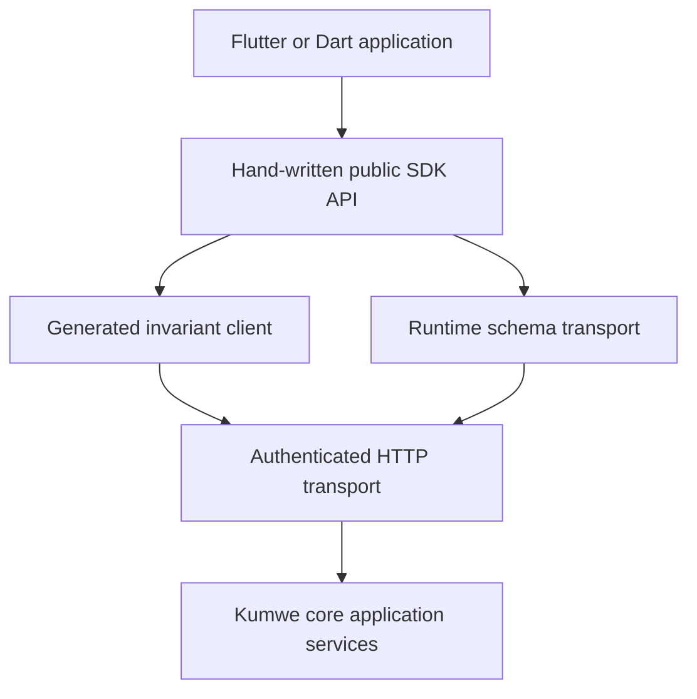

# Architecture

## Context

The SDK sits between a Kumwe deployment and a Dart application. It translates adopted wire contracts into Dart
types, but it does not own server policy, extension execution, storage, workflow or authorization decisions.



The generated and runtime paths meet only at transport, execution context, exact-value codecs, failures and cache
invalidation. A runtime extension never alters generated Dart source inside a running application.

## Architectural principles

1. **Server authority.** The client may pre-validate for usability, but server authorization, validation, version,
   idempotency and workflow results are final.
2. **Two contract planes.** Stable core resources are generated; policy-filtered business definitions and client
   surfaces are interpreted at runtime.
3. **Closed input.** Unknown JSON keys, schema formats and surface kinds fail as unsupported instead of being ignored.
4. **No executable extension payload.** Runtime contributions are data with a finite vocabulary.
5. **Explicit context.** Site, organization, workspace, credential purpose and generation bindings are never inferred
   from host names or global process state.
6. **Exact values.** Decimal, money and quantity values stay in exact wire forms.
7. **Profile honesty.** A package advertises only the parity profiles it has proved.
8. **Flutter-independent core.** Transport and models are usable by Dart without importing Flutter.

## Layers and dependency direction

| Layer | Responsibility | May depend on |
| --- | --- | --- |
| Public API | Stable application-facing clients, values and results | Domain-neutral models, generated/runtime ports |
| Domain-neutral models | Context, exact values, versions, cursors, failures, capability states | Dart core only |
| Generated invariant client | Adopted fixed routes and DTO codecs | Domain-neutral models, transport port |
| Runtime contract client | Business catalog, JSON Schema subset, client-surface manifest | Domain-neutral models, validator, transport port |
| Transport | HTTP, headers, content negotiation, cancellation, timeouts | Dart I/O abstraction and injected adapters |
| Application ports | Token provider, transport, clock, cache, and future authorization/context ports | Domain-neutral models only |

Dependencies point downward in the table. Generated code must not import the runtime contract validator/model
layer; that layer must not inspect private generated-client implementation.

## Build-time invariant plane

The generator consumes one adopted, release-owned core OpenAPI artifact. Generation requires:

- a core release identifier and immutable SHA-256 digest;
- a complete request, success, error, authentication and parameter schema for included operations;
- a compatibility classification for every public operation and schema;
- deterministic canonical input; and
- an allowlist of supported OpenAPI 3.1/JSON Schema features.

The caller-specific `/api/v1/openapi.json` is not a generator input. Its bytes depend on runtime generation and
authorization fingerprint; generating from it would produce a different library for each user and could preserve
temporarily visible fields after authority is revoked.

Generated types cover only invariant envelopes and core resources. Business-definition-specific record classes are
not generated into the package because activated definitions change independently of the Dart release.

## Runtime schema plane

The runtime client consumes three independent documents when core adopts them:

1. a capability snapshot saying which optional client contracts are present;
2. the existing policy-filtered business definition/catalog data; and
3. a policy-filtered client-surface manifest conforming to the adopted descendant of the proposal in
   [`contracts/`](../contracts/README.md).

The runtime layer produces validated, immutable wire-level manifest and business-definition values, including
namespaced references and bounded presentation hints. It does not produce host screen/view models or widgets. The
separate Flutter client compiles those values into accessible navigation, screen state, and native controls.

Unsupported schema keywords, field types, widgets or screen kinds produce a typed `unsupported_contract` result.
The application may show a safe unavailable state or omit the contribution according to product policy. It must not
guess a widget or open a manifest-provided URL.

## Transport boundary

The transport is responsible for:

- TLS HTTPS requests to an application-approved origin;
- `Authorization`, exactly one `Kumwe-Site`, correlation, content type and accepted language headers;
- cancellation and bounded request/response sizes;
- safe redirect policy that never forwards credentials to a new origin;
- ETag, `If-Match`, `Idempotency-Key`, `Retry-After` and replay response handling;
- decoding only the declared success or Problem Details media type; and
- producing redacted diagnostics.

The transport does not automatically retry a mutation with a new idempotency key. It may retry an identical
idempotent request with the same key and bytes only when the adopted operation contract permits it.

## Context and cache model

Every request uses an immutable `KumweExecutionContext`. The minimum key is:

```text
origin + site + credential-family + organization + workspace
```

When supplied by core, caches additionally bind membership version, policy generation, security epoch, trusted
runtime generation, definition version/checksum and authorization fingerprint. Missing binding data reduces what
may safely be cached; it never permits a broader cache key.

On token change, context switch, 401/403, explicit generation change or definition checksum change, affected
metadata and records are evicted. Sensitive/write-only fields are never persisted in ordinary caches.

## Concurrency and mutation model

A mutation carries an application-created intent object containing:

- a stable idempotency key for that exact intent;
- the expected strong entity version when required;
- immutable execution context;
- canonical serialized input; and
- optional cancellation/deadline metadata.

The SDK retains the key for an identical retry but does not treat it as an offline sync queue. A 412 requires
re-read and explicit conflict handling. A 409 may mean in-progress, duplicate-window or domain conflict and must be
classified through the adopted stable problem code.

Atomicity stops at the server application service. The SDK never advertises a multi-request transaction. Aggregate
documents require a dedicated adopted server command.

## Exact values

| Value | Dart representation policy | Wire form |
| --- | --- | --- |
| Decimal | validated canonical decimal string/value object | JSON string |
| Money | value object with decimal amount and ISO currency | closed object |
| Quantity | value object with decimal amount and unit | closed object |
| Date/time | validated ISO values retaining declared semantics | JSON string |
| Identifier | validated opaque string; no numeric coercion | JSON string |

Calculations are outside the transport SDK unless an exact arithmetic module has its own tests and semantics. A
display formatter must never rewrite the value sent back to core.

## Offline and realtime boundary

The architecture leaves ports for a future change feed, local mutation journal and notification hint, but none is
part of the baseline. Internal Kumwe integration events are not consumed directly. See
[ADR 0005](decisions/0005-offline-sync-is-a-separate-profile.md).

## Related documents

- [Client API](client-api.md)
- [Authentication and context](authentication-and-context.md)
- [Extension client surfaces](extension-client-surfaces.md)
- [Security](security.md)
- [Quality and conformance](quality-and-conformance.md)
