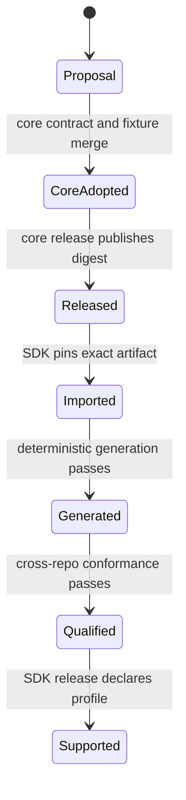

# Source of truth and cross-repository contract lifecycle

## Ownership

| Contract or artifact | Authority before adoption | Long-term owner |
| --- | --- | --- |
| Core REST routes, DTOs, errors and auth schemes | `kumwe/app` current source | `kumwe/app` |
| Generated business definition/record wire contract | `kumwe/app` current source | `kumwe/app` |
| Client capability index | Proposal in this repository | `kumwe/app` once adopted |
| Client-surface contribution grammar | Proposal in this repository | `kumwe/app` once adopted |
| Pinned core contract digest and generated Dart snapshot | None yet | This repository, derived from core |
| Public Dart API and adapters | This repository | This repository |
| Cross-release conformance fixtures | Both repositories | Joint, with identical fixture identities |

The files in [`contracts/`](../contracts/README.md) are design inputs. Proposal control documents carry
`authoritative: false`; schemas and examples carry proposal-scoped identifiers and descriptions. Those
machine-readable markers are safety boundaries, not editorial wording.

## Programme and gate ownership

Contract work here is parallel to, and does not amend, Kumwe core Version 2, Gate A or Gate B. It is design and
conformance input for a **proposed Version 3 Native Client Platform**. Neither a merged SDK proposal nor a passing
SDK fixture can mark future core work complete.

If adopted, the Version 3 core roadmap should own a native-client contract/SDK-readiness gate before SDK generation
and a final parity-qualification gate before profile claims. Core adoption, release and cross-surface evidence must
close those gates in the authoritative programme. The lifecycle below describes how this repository can contribute
evidence; it does not assert that either gate currently exists.

## Lifecycle states

No state is skipped. In particular, copying a proposal into generated code does not make it adopted.

### 1. Proposal

This repository may describe a missing contract with:

- a stable proposal identifier;
- explicit non-authoritative status;
- bounded JSON Schema and valid examples;
- a current-core evidence link;
- security and compatibility analysis; and
- an adoption owner.

Proposal versions use prerelease identifiers such as `0.1.0-proposal.1`. They make review changes visible but
carry no server compatibility promise.

### 2. Core adoption

Core adoption requires one coherent core change containing:

- the public endpoint or contribution schema and its runtime behavior;
- complete OpenAPI/request/success/error representation;
- stable machine error codes;
- policy filtering and lifecycle invalidation;
- semantic version/deprecation rules;
- positive, negative and lifecycle compatibility fixtures; and
- documentation that calls the contract current only after tests prove it.

The core-owned identifier and schema `$id` replace proposal identifiers. This repository records the mapping rather
than pretending both documents are the same authority.

### 3. Core release

An SDK imports only an artifact from a tagged core release. The release manifest supplies:

- core version and commit;
- canonical OpenAPI and auxiliary schema digests;
- compatibility generation;
- supported/deprecated/withdrawn contract list; and
- fixture bundle digest.

Branch URLs and mutable “latest” artifacts are not acceptable generator inputs.

### 4. SDK import and generation

The SDK records the exact artifact digest, generator version and feature-policy version. Generation occurs in a clean
tree twice; both results must be byte-identical. Hand edits to generated files fail the build.

The runtime client-surface schema is imported as data and compiled into a validator/model vocabulary. It is not used
to generate one Dart class per active extension.

### 5. Qualification and support

Cross-repository fixtures run against every core version in the SDK's stated support window. A supported profile is
published only after the corresponding outcomes pass. See [Quality and conformance](quality-and-conformance.md).

## Compatibility matrix

Each SDK release publishes a matrix like:

| SDK | Core range | REST generation | Client-surface generation | Profiles |
| --- | --- | --- | --- | --- |
| `0.x` | none promised | proposal | proposal | none |
| future `1.y` | explicit bounded range | adopted value | adopted value | exact declared set |

A core range is never inferred from HTTP 200 responses. Startup capability discovery checks exact contract
identifiers and versions. A missing required contract returns a compatibility failure before a mutation is attempted.

## Change classification

| Change | Required handling |
| --- | --- |
| Add optional response field in an explicitly extensible object | Minor core contract change; SDK ignores only where contract permits |
| Add field to a closed object | New schema version; old version remains supported during the window |
| Add optional operation | Minor capability addition; no existing profile widens automatically |
| Remove/rename operation, enum or problem code | Breaking generation; migration and compatibility window required |
| Tighten validation bound | Compatibility analysis and fixture; potentially breaking |
| Change authorization or context binding | Security-significant contract revision, never patch-only |
| Change idempotency/replay semantics | Behavior-breaking revision with migration/retry guidance |

## Drift handling

If runtime bytes do not match their declared digest, the SDK fails closed with a contract-integrity error. If a
runtime manifest is newer but declares a supported compatible generation, unknown optional contributions are
reported and omitted; unknown required vocabulary fails the surface.

The SDK must not silently fall back from HTTPS, discard a site header, relax JSON Schema, or use a stale caller's
capability snapshot to recover from drift.

## Emergency withdrawal

A vulnerable contract may be withdrawn before the normal window only with:

- a core security advisory and fixed release;
- an SDK denylist/update identifying affected generations;
- a safe failure message without sensitive detail;
- migration instructions; and
- an explicit exception in the release evidence.

Removing proposal files in this repository does not withdraw a core contract.

## Review checklist

Every cross-repository contract change answers:

1. Which repository is authoritative now?
2. What stable identifier and generation changed?
3. Is the object closed and bounded?
4. Which security/context bindings are part of the digest?
5. What is additive, breaking, deprecated or withdrawn?
6. Which fixture proves lifecycle, denial and stale-generation behavior?
7. Which SDK profile is affected?
8. What happens when client and server versions disagree?

The process is captured in [ADR 0003](decisions/0003-core-owns-wire-contracts.md).
